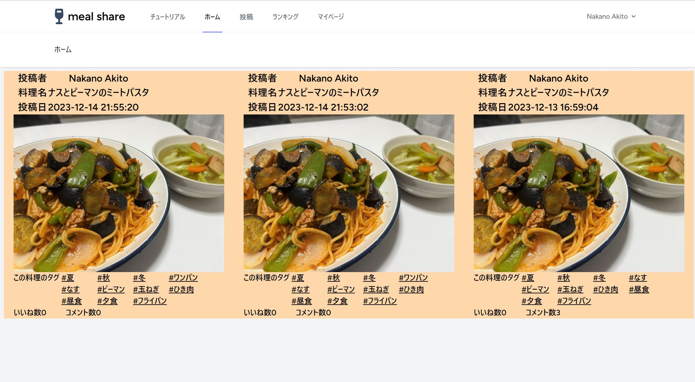
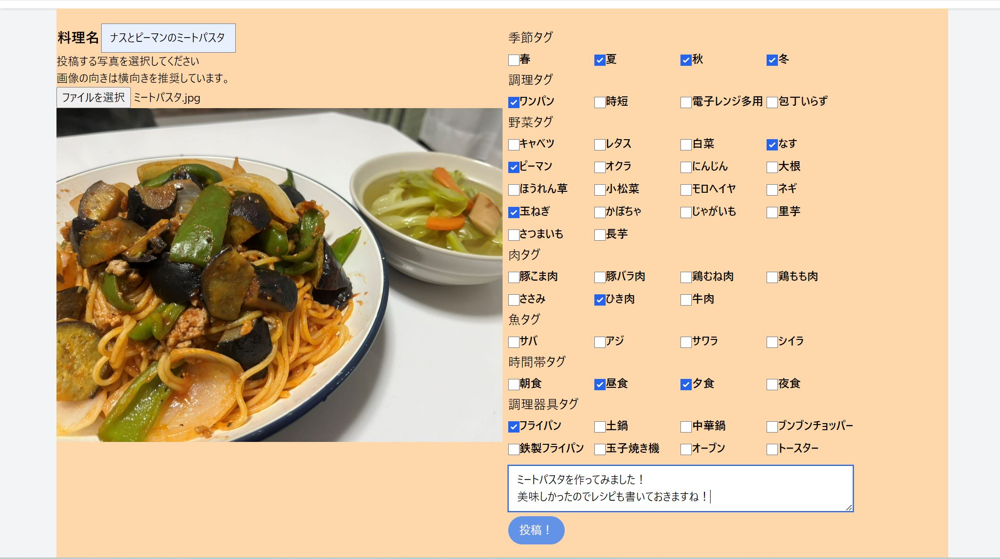
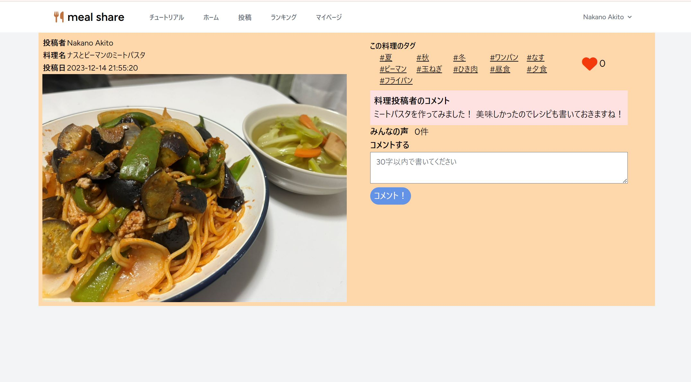
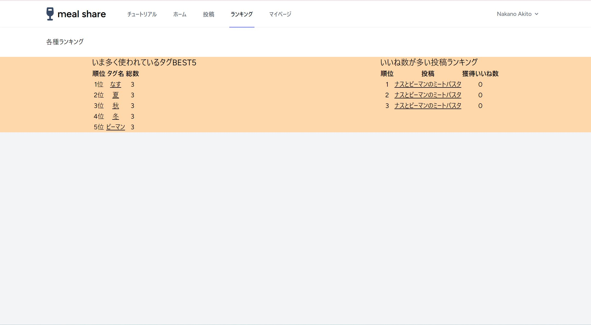
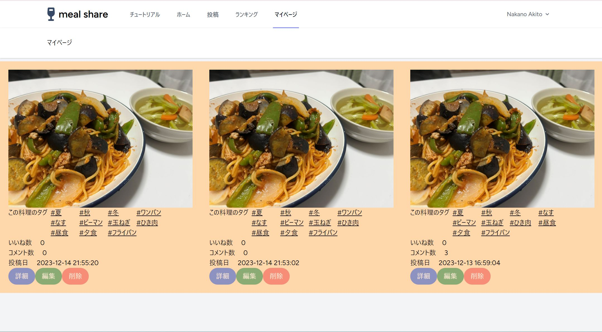

# 料理系SNS「meal share」
- Laravel9のプロトタイピング
- アプリURL：https://mealshare-16763142a330.herokuapp.com

## コンセプト
- 料理を投稿する人も、投稿しない人も楽しめるようにする。

## ターゲット
- 料理をするのが好きで、自分の料理を他者に自慢したい人
- 他者の投稿を見て、自分の料理の参考にしたい人
- 料理を見るのが好きな人

## アプリ概要
> 閲覧画面

> 投稿画面

> 投稿詳細画面

> ランキング画面

> マイページ画面

*詳しい説明はアプリ内のチュートリアルをご覧ください。*
